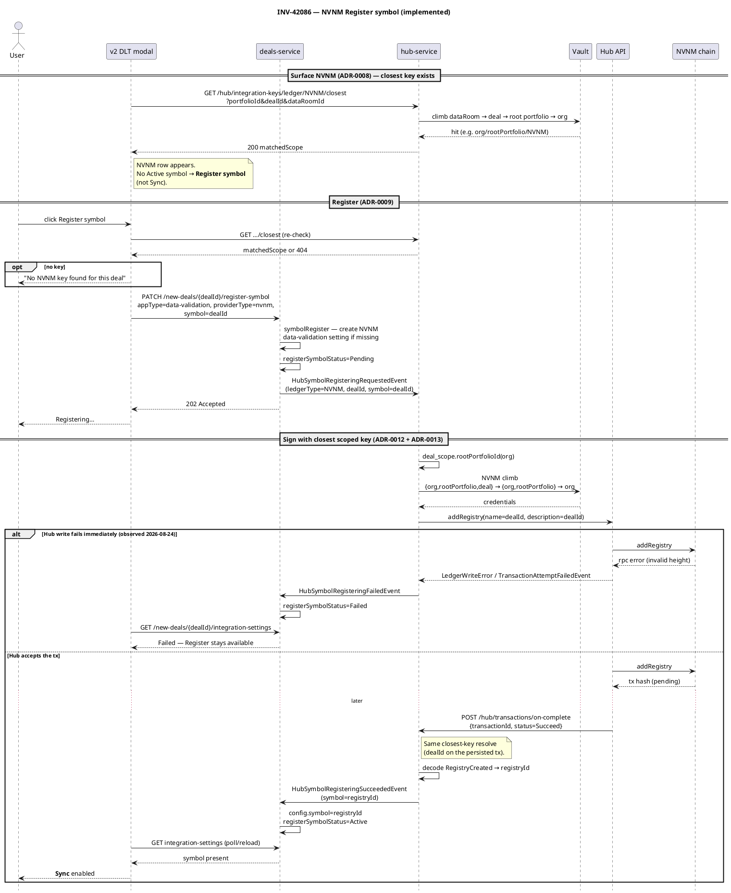

```plantuml
@startuml
title INV-42086 — NVNM Register symbol (implemented)

skinparam sequenceMessageAlign center
skinparam responseMessageBelowArrow true
hide footbox

actor User
participant "v2 DLT modal" as UI
participant "deals-service" as Deals
participant "hub-service" as HubMs
participant Vault
participant "Hub API" as HubApi
participant "NVNM chain" as Chain

== Surface NVNM (ADR-0008) — closest key exists ==
UI -> HubMs: GET /hub/integration-keys/ledger/NVNM/closest\n?portfolioId&dealId&dataRoomId
HubMs -> Vault: climb dataRoom → deal → root portfolio → org
Vault --> HubMs: hit (e.g. org/rootPortfolio/NVNM)
HubMs --> UI: 200 matchedScope
note right of UI
  NVNM row appears.
  No Active symbol → **Register symbol**
  (not Sync).
end note

== Register (ADR-0009) ==
User -> UI: click Register symbol
UI -> HubMs: GET …/closest (re-check)
HubMs --> UI: matchedScope or 404
opt no key
  UI --> User: "No NVNM key found for this deal"
end

UI -> Deals: PATCH /new-deals/{dealId}/register-symbol\nappType=data-validation, providerType=nvnm,\nsymbol=dealId
Deals -> Deals: symbolRegister — create NVNM\ndata-validation setting if missing
Deals -> Deals: registerSymbolStatus=Pending
Deals -> HubMs: HubSymbolRegisteringRequestedEvent\n(ledgerType=NVNM, dealId, symbol=dealId)
Deals --> UI: 202 Accepted
UI --> User: Registering…

== Sign with closest scoped key (ADR-0012 + ADR-0013) ==
HubMs -> HubMs: deal_scope.rootPortfolioId(org)
HubMs -> Vault: NVNM climb\n{org,rootPortfolio,deal} → {org,rootPortfolio} → org
Vault --> HubMs: credentials
HubMs -> HubApi: addRegistry(name=dealId, description=dealId)

alt Hub write fails immediately (observed 2026-08-24)
  HubApi -> Chain: addRegistry
  Chain --> HubApi: rpc error (invalid height)
  HubApi --> HubMs: LedgerWriteError / TransactionAttemptFailedEvent
  HubMs -> Deals: HubSymbolRegisteringFailedEvent
  Deals -> Deals: registerSymbolStatus=Failed
  UI -> Deals: GET /new-deals/{dealId}/integration-settings
  Deals --> UI: Failed — Register stays available
else Hub accepts the tx
  HubApi -> Chain: addRegistry
  Chain --> HubApi: tx hash (pending)
  ... later ...
  HubApi -> HubMs: POST /hub/transactions/on-complete\n{transactionId, status=Succeed}
  note right of HubMs
    Same closest-key resolve
    (dealId on the persisted tx).
  end note
  HubMs -> HubMs: decode RegistryCreated → registryId
  HubMs -> Deals: HubSymbolRegisteringSucceededEvent\n(symbol=registryId)
  Deals -> Deals: config.symbol=registryId\nregisterSymbolStatus=Active
  UI -> Deals: GET integration-settings (poll/reload)
  Deals --> UI: symbol present
  UI --> User: **Sync** enabled
end
@enduml
```